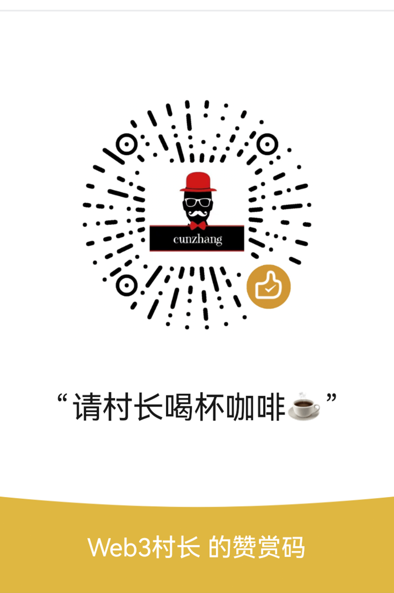

# CunFetch

面向内容创作者的多发布流程工具。本仓库公开的是它的一个核心组件：**云端收件箱 + 看板**（基于 Cloudflare Workers + R2）。

AI 助手（如 muse）把做好的**短视频 + 封面 + 自媒体平台文章内容**上传到云端收件箱；你在网页看板上一眼看到当天各发布时段的素材、封面和标签，确认无误后一键复制、下载、发布。

## 仓库内容

```text
CunFetch/
├── worker/                          # 云端收件箱 + 看板（Cloudflare Workers + R2）
│   ├── wrangler.toml                # Worker 配置 + R2 bucket(binding: INBOX)
│   └── src/
│       ├── index.js                 # API 路由 + 下载 + 看板渲染
│       └── dashboard.js             # 看板单页 UI（唯一 UI 真源）
└── .github/workflows/
    ├── deploy-inbox-worker.yml      # 手动部署 Worker（workflow_dispatch）
    └── check-blog.yml               # 博客检测（已暂停定时，仅手动触发）
```

## 它在流程中的位置

```text
AI 助手(muse) 生产视频素材
   │  上传 (platforms.json + 封面 + mp4，可打包 zip)
   ▼
Cloudflare Worker 收件箱 (R2)
   │  按 日期/档位/slug 归档
   ▼
网页看板 (/)
   │  封面 + 三平台标题/标签 + 下载状态
   ▼
创作者 预览 → 复制 → 下载 → 发布
```

素材按 **发布档位** 归档：

| 档位 | slot | 时间（北京时间） |
| --- | --- | --- |
| 早 | `early` | 09:05 |
| 中 | `mid` | 12:10 |
| 晚 | `late` | 19:08 |

## 自媒体图文（5 平台）

除了短视频，收件箱还支持**一篇自媒体图文**：muse 把写好的内容打包成一个 **zip** 上传（表单加 `type=article`），本地在**晚间档（late）**随视频一起拉取，解压到 `D:\CunContent\自媒体\<日期>_<标题>\`，交给 CunWrite 扫描 → 勾平台 → 直接进各平台草稿箱。

zip 内按平台分子目录（文件夹中英文名都认），标题取自 zip 文件名：

```text
<标题>.zip
├── wechat/        article.json + cover.png (+ 正文插图 inline-1.png)
├── xiaohongshu/   article.json + cover.png
├── toutiao/       article.json + cover.png
├── baijiahao/     article.json + cover.png
└── zhihu/         article.json + cover.png
```

- 某个平台**不需要发** → 该子目录直接不建，其余照常。
- 本地落盘：`D:\CunContent\自媒体\<YYYY-MM-DD>_<标题>\`，结构与上面一致。

## 自动清理（保留 7 天）

R2 只是中转站：素材上传后**保留 7 天**，过期由 Worker 每天自动清理，不长期占用存储。

- **保留期**：7 天，以对象上传时间为准
- **清理范围**：视频线 `inbox/` + 图文线 `articles/`（含封面、platforms.json、状态文件）
- **触发方式**：Worker Cron 定时任务，每天北京时间 04:00 执行一次
- **手动核验**：`POST /api/cleanup`，加 `?dry=1` 可只统计不删除

## 部署

参见 [`worker/README.md`](worker/README.md)：手动在 GitHub Actions `Deploy Inbox Worker` 触发，Cloudflare 无需本机操作。

## 打赏支持

如果 CunFetch 帮到了你，欢迎请村长喝杯咖啡～你的支持是持续更新的动力。

| 微信 | 支付宝 |
| --- | --- |
|  |  | 

## 协议

© 2026 CunFetch
